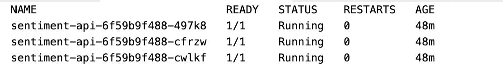
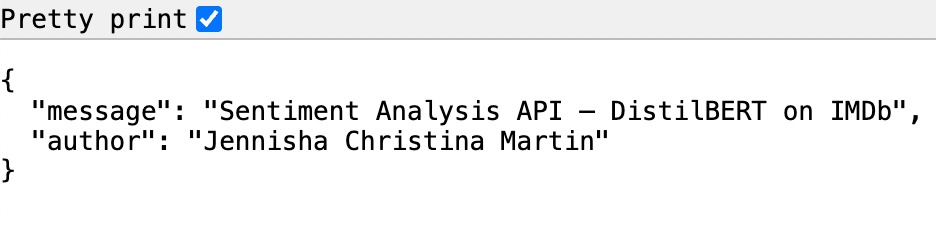
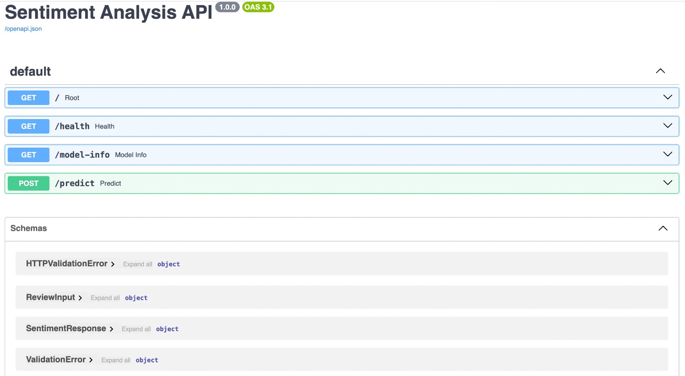
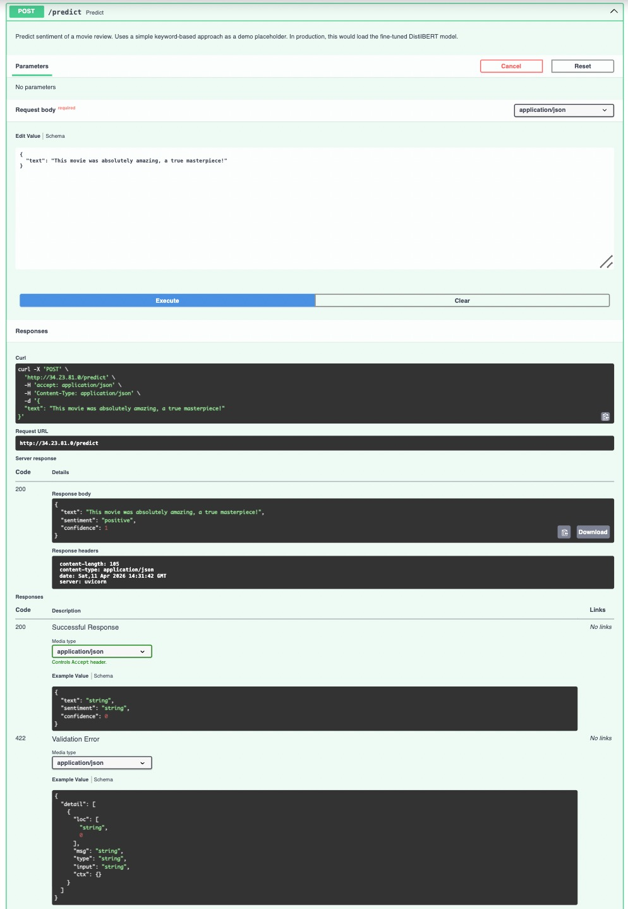

# Lab_06 — GKE Cluster Creation & Sentiment Analysis API Deployment

---

## Overview

In this lab, I created a **Google Kubernetes Engine (GKE)** cluster and deployed a
**Sentiment Analysis API** built with FastAPI. The API simulates a DistilBERT-based
sentiment classifier trained on the IMDb movie reviews dataset. This covers the full
workflow: cluster provisioning, Docker containerization, image registry, Kubernetes
deployments, services, and autoscaling.

### Features

- **Sentiment Analysis API** — FastAPI app with 4 endpoints (`/`, `/health`, `/model-info`, `POST /predict`)
- **DistilBERT on IMDb** — simulates a fine-tuned sentiment classifier on 50K movie reviews
- **GKE Autopilot cluster** — regional cluster in `us-east1` with `e2-standard-2` machines and pd-ssd disks
- **Kubernetes manifests** — namespace, deployment (3 replicas), LoadBalancer service, HPA
- **Health monitoring** — liveness and readiness probes on `/health`
- **Autoscaling** — HorizontalPodAutoscaler scales pods 3–5 based on CPU (70%)
- **Resource management** — CPU and memory requests/limits for proper pod scheduling
- **Security** — shielded secure boot, workload vulnerability scanning, cluster labels
- **Automation** — `deploy.sh` script for full build-push-deploy pipeline

---

## Prerequisites

- A Google Cloud Platform (GCP) account
- `gcloud` CLI installed and initialized (`gcloud init`) — [Installation guide](https://cloud.google.com/sdk/docs/install-sdk)
- **kubectl** installed — [Installation guide](https://kubernetes.io/docs/tasks/tools/)
- **Docker** installed and running

---

## Part 1: Creating the GKE Cluster

```bash
chmod +x create_cluster.sh
./create_cluster.sh
```

This script creates the cluster, fetches credentials, creates the `sentiment-serving`
namespace, and sets it as the default context.

### Cluster Configuration Summary

| Setting              | Value                          |
| -------------------- | ------------------------------ |
| Cluster Name         | jennisha-mlops-cluster         |
| Region               | us-east1                       |
| Machine Type         | e2-standard-2                  |
| Disk Type            | pd-ssd (50 GB)                 |
| Node Autoscaling     | 1–3 nodes                      |
| Release Channel      | Stable                         |
| Monitoring           | Managed Prometheus             |
| Security             | Shielded nodes + secure boot   |
| Labels               | env=lab, owner=jennisha, model=distilbert, dataset=imdb |

### Accessing the Cluster

```bash
gcloud container clusters get-credentials jennisha-mlops-cluster --region us-east1
kubectl config current-context
kubectl get nodes
kubectl get ns
```

---

## Part 2: Deploying the Sentiment Analysis API

### The Application

The FastAPI application serves a sentiment analysis model with 4 endpoints:

| Method | Endpoint      | Description                                  |
| ------ | ------------- | -------------------------------------------- |
| GET    | `/`           | Welcome message with author and model info   |
| GET    | `/health`     | Health check for Kubernetes probes           |
| GET    | `/model-info` | Model metadata (DistilBERT, IMDb, classes)   |
| POST   | `/predict`    | Predict sentiment of a movie review text     |

### Automated Deployment

```bash
chmod +x deploy.sh
./deploy.sh
```

### Manual Deployment

#### Step 1: Build and Push Docker Image

```bash
cd Lab_06

docker build --platform linux/amd64 -t sentiment-api:v1 app/
gcloud auth configure-docker
docker tag sentiment-api:v1 gcr.io/kubernetes-labs-mlops-jcm/sentiment-api:v1
docker push gcr.io/kubernetes-labs-mlops-jcm/sentiment-api:v1
```

#### Step 2: Apply Kubernetes Manifests

```bash
kubectl apply -f k8s/namespace.yaml
kubectl apply -f k8s/deployment.yaml
kubectl apply -f k8s/service.yaml
kubectl apply -f k8s/hpa.yaml
```

#### Step 3: Verify the Deployment

```bash
kubectl get deployments -n sentiment-serving
kubectl get pods -n sentiment-serving
kubectl get service -n sentiment-serving
kubectl get hpa -n sentiment-serving
```

#### Step 4: Test the API

```bash
EXTERNAL_IP=$(kubectl get svc sentiment-api-service -n sentiment-serving -o jsonpath='{.status.loadBalancer.ingress[0].ip}')

curl http://${EXTERNAL_IP}/
curl http://${EXTERNAL_IP}/health
curl http://${EXTERNAL_IP}/model-info

curl -X POST http://${EXTERNAL_IP}/predict \
  -H "Content-Type: application/json" \
  -d '{"text": "This movie was absolutely amazing, a true masterpiece!"}'

curl -X POST http://${EXTERNAL_IP}/predict \
  -H "Content-Type: application/json" \
  -d '{"text": "Terrible film, boring and a complete waste of time."}'
```

### Kubernetes Resources Created

| Resource             | Type                      | Description                                 |
| -------------------- | ------------------------- | ------------------------------------------- |
| sentiment-serving    | Namespace                 | Isolated namespace for the deployment       |
| sentiment-api        | Deployment (3 replicas)   | Runs the FastAPI sentiment analysis server  |
| sentiment-api-service| LoadBalancer Service      | Exposes the API on port 80                  |
| sentiment-api-hpa    | HorizontalPodAutoscaler   | Scales pods 3–5 based on CPU (70%)          |

---

## Screenshots

### Pods Running (3/3)

All three replicas of the sentiment-api deployment are running and healthy.



### Service with External IP

The LoadBalancer service has been assigned external IP `34.23.81.0`.


### HorizontalPodAutoscaler Active

The HPA is monitoring CPU utilization (target 70%), maintaining 3 replicas.


### Welcome Endpoint

Browser showing the root endpoint at `http://34.23.81.0/`.



### Swagger UI

FastAPI auto-generated documentation at `http://34.23.81.0/docs` showing all 4 endpoints.



### Sentiment Prediction

POST `/predict` returning sentiment classification results.



---

## Project Structure

```
Lab_06/
├── create_cluster.sh           # GKE cluster creation script
├── deploy.sh                   # Automated build-push-deploy pipeline
├── app/
│   ├── main.py                 # Sentiment Analysis FastAPI app (4 endpoints)
│   ├── requirements.txt        # Python dependencies
│   └── Dockerfile              # Container image definition
├── k8s/
│   ├── namespace.yaml          # sentiment-serving namespace
│   ├── deployment.yaml         # 3 replicas with health probes + labels
│   ├── service.yaml            # LoadBalancer service
│   └── hpa.yaml                # HorizontalPodAutoscaler (CPU-based)
├── screenshots/
│   ├── pods.png                # kubectl get pods — 3/3 Running
│   ├── service.png             # kubectl get svc — external IP
│   ├── hpa.png                 # kubectl get hpa — autoscaler active
│   ├── api-welcome.png         # Browser: root endpoint
│   ├── ui.png                  # Browser: /docs Swagger UI
│   └── api-predict-result.png  # POST /predict result
├── README.md
└── SETUP_README.md             
```

---

## Cleanup

```bash
kubectl delete namespace sentiment-serving
gcloud container clusters delete jennisha-mlops-cluster --region us-east1 --project kubernetes-labs-mlops-jcm
```
